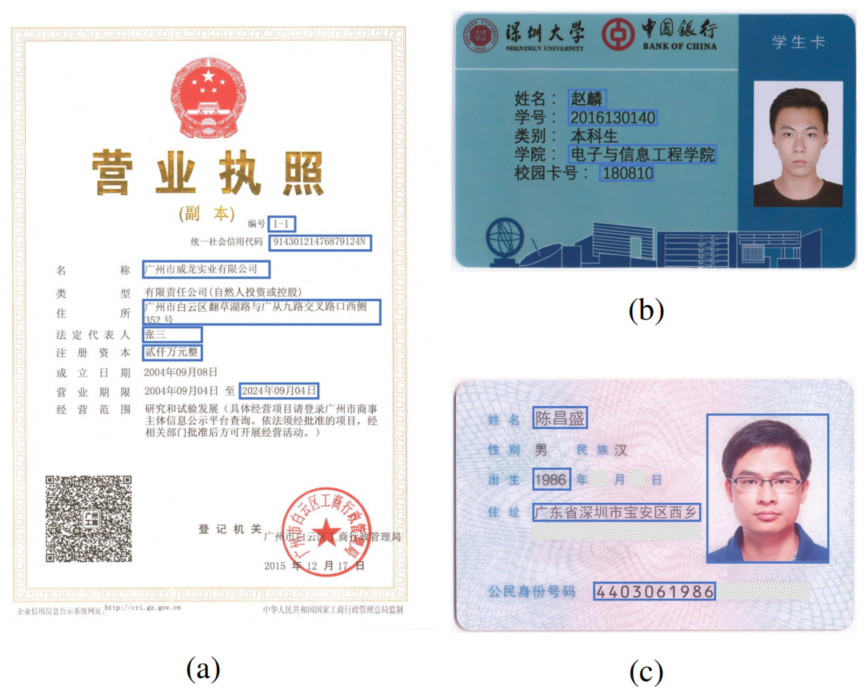
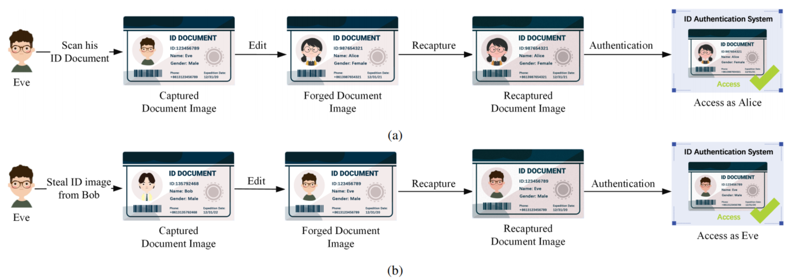
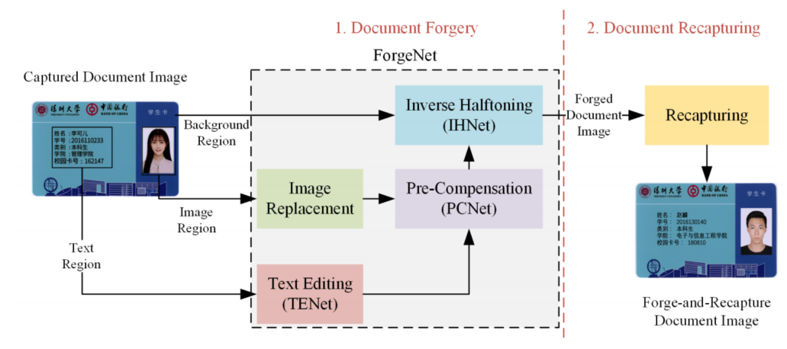
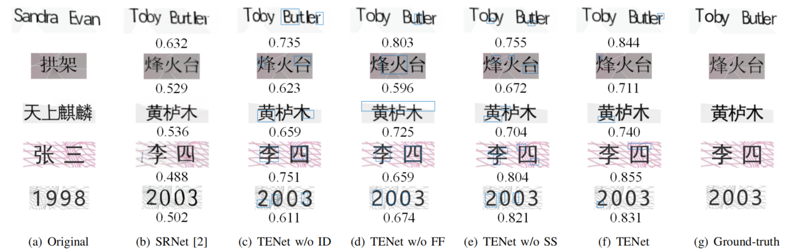
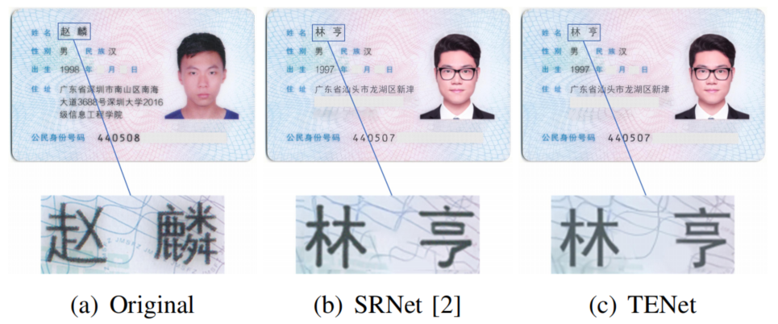

# Deep-Learning-based-Forgery-Attack-on-Document-Images

Introduction of the following paper: [L. Zhao, C. Chen, J. Huang, "Deep Learning-based Forgery Attack on Document Images," arXiv preprint arXiv: 2102.00653, 2021.](https://arxiv.org/abs/2102.00653) This paper is accepted by IEEE Transactions on Image Processing, 2021/08.

The paper proposes a low-cost document image editing algorithm through deep learning-based techniques and addresses the limitations of existing text editing algorithms for editing text on complex characters and complex backgrounds through a set of network design strategies. The practical results of document editing are as follows. The edited regions are boxed out in blue.

<!--  -->

## 1. Introduction
Due to the COVID-19 pandemic, we have observed an unprecedented demand for online document authentication in the applications of e-commerce and e-government. Some important document images were uploaded to online platforms for various purposes. However, the content of document can be altered by some image editing tools or deep learning-based technologies. 

Recently, it has been demonstrated that characters and words in natural images can be edited with convolutional neural networks [1]–[3] in an end-to-end fashion. To the best of our knowledge, there is no existing works on evaluating impacts of the above deep learning-based textual contents generation schemes towards document security. The edited text images have not been investigated from a forensic aspect.

Authentication of hardcopy documents with digitally acquired document images is a forensic research topic with broad interest. To evaluate the security of existing digital document authentication systems under the forge-and-recapture attacks, a high-quality dataset containing forge-and-recapture document images is needed. To the best of our knowledge, no such dataset is currently available for evaluation. In this work, we build a deep learning-based document forgery network that can quickly generate a large number of forgery datasets for forensic experiments. A formal attack model with two scenarios is shown in the following figure.

<!--  -->

There are two representative forge-and-recapture attack scenarios. (a) The attacker scans his/her own identity document to obtain an identity document image and forges the document of a target identity to perform an impersonate attack. (b) The attacker steals an identity document image and forge his/her own document to obtain unauthorized access.

## 2. Method
The document forgery attack is divided into the forgery (through the proposed deep network, ForgeNet) and recapturing steps. For the forgery process, the document image acquired by an imaging device is employed as input to the ForgeNet. It is divided into three regions, i.e., text region, image region, and background region (the areas that are not included in the first two categories). The background region is processed by the inverse halftoning module (IHNet) to remove the halftone dots in the printed document. The original content in the image region is replaced by the target image, and the resulting image is fed into the print-and-scan pre-compensation module (PCNet) and IHNet. It should be noted that the PCNet deliberately distorts the color and introduces halftone patterns in the edited region such that the discrepancies between the edited and background regions are compensated. The text region is subsequently forwarded to the text editing module (TENet), PCNet and IHNet. After processed by the ForgeNet, the three regions are stitched together to form a complete document image. Lastly, the forged document image is recaptured by cameras or scanners to finish the forge-and-recapture attack.

<!--  -->

For more details on network architecture, please refer to our [paper](https://arxiv.org/abs/2102.00653).

## 3. Experimental Results
We propose the text editing network, TENet by adapting SRNet [2] to our task. However, SRNet is originally designed for editing English alphabets and Arabic numerals in scene images for visual translation and augmented reality applications. It does not perform well on Chinese characters with complicated structure, especially in document with complex background. We design experiments to qualitatively and quantitatively examine the modules in TENet which are different from SRNet so as to show the effectiveness of our approach. Three main differences between our proposed SRNet and TENet are as follows:
+ We perform image differentiation operation between the source image and the output of the background inpainting subnet to obtain style text image without background. 
+ The style text image without background is then fed into a hard-coded component to extract the text skeleton of the style text which is then directly input to the text conversion subnet as supervision information. 
+ Instead of only using a general U-Net structure to fuse different components (as in SRNet), we adopt a fine fusion subnet in TENet with consideration on texture continuity.

The following table is comparisons of SRNet [2] and different settings of TENet. The best results are highlighted in bold.

|     Method    |    MSE    |   PSNR  |   SSIM  |
|:-------------:|:---------:|:-------:|:-------:|
|   SRNet [2]   |   0.032   |  16.44  |  0.519  | 
| TENet w/o ID  |   0.027   |  17.37  |  0.687  | 
| TENet w/o ID  |   0.019   |  19.14  |  0.635  |
| TENet w/o ID  |   0.015   |  19.75  |  0.708  | 
|      TENet    | **0.011** |**20.48**|**0.731**|

The following figure is comparisons of SRNet and different configurations of the proposed TENet on synthetic character dataset. (a) Original images. (b) Edited by SRNet. (c) Edited by TENet without image differentiation (ID). (d) Edited by TENet without fine fusion (FF). (e) Edited by TENet without skeleton supervision (SS). (f) Edited by the proposed TENet. (g) Ground-truth. Differences between the results from TENet and the ground-truth are boxed out in blue. The SSIM metric computed from each edited document and the ground-truth is shown under each image from (b) to (f).

<!--  -->

The results look unrealistic in the absence of these three components. The importance of image differentiation, fine fusion, and skeleton supervision are reflected in the quality of characters, the background texture, and the character skeleton, respectively. Both quantitative analysis and visual examples clearly indicate the importance of the three components.

We also choose Resident Identity Card for People’s Republic of China with a complex background as a target document. Identity card tampering is a more practical and challenging task to evaluate the performance of the proposed ForgeNet. More importantly, the Resident Identity Card is an important type of document with some off-the-shelf authentication algorithms. These algorithms can be employed as baselines to evaluate the effectiveness of our attack towards some state-of-the-art document authentication systems. As shown in the following figure, ForgeNet achieves a good forgery performance by fine-tuning with only one image, while the text and background in the image reconstructed by SRNet are distorted.

<!--  -->

The forged identity card images obtained from ForgeNet are processed by the print-and-scan channel to demonstrate the threat posed by the forge-and-recapture attack. The popular off-the-shelf document authentication platforms in China includes [Baidu AI](https://ai.baidu.com/tech/ocr_cards/idcard), [Tencent AI](https://cloud.tencent.com/product/cardocr), and [MEGVII Face++ AI](https://www.faceplusplus.com.cn/idcard-recognition). We uploaded tampering results to these three state-of-the-art document authentication platforms for validation of the forgeandrecapture identity documents.

The authentication results on MEGVII Face++ AI are shown in the following table. The items "Edited", "Photocopy", "Identity Photo" and "Screen" denote the probabilities of image editing, photocopies, identity card images and screen recapturing, respectively. It is shown that the 10 forge-and-recapture identity images in our test are successfully authenticated. All the tested images also pass the other two authentication platforms (include inspection against editing, recapturing, etc.). Given the fact that the state-of-the-art document authentication platforms have difficulties in distinguishing the forge-andrecapture document images, it fully demonstrates the success of our attack.

|  No.   | Edited | Photocopy | Identity Photo | Screen |
|:------:|:------:|:---------:|:--------------:|:------:|
|   01   |    0   |    0      |      0.994     | 0.006  |
|   02   |    0   |    0      |      0.996     | 0.004  | 
|   03   |    0   |    0      |      0.941     | 0.059  | 
|   04   |    0   |    0      |      0.913     | 0.087  | 
|   05   |  0.009 |    0      |      0.991     |    0   | 
|   06   |    0   |    0      |      0.958     | 0.042  | 
|   07   |    0   |    0      |      0.958     | 0.042  | 
|   08   |    0   |    0      |      0.989     | 0.011  | 
|   09   |    0   |    0      |      0.983     | 0.017  | 
|   10   |    0   |    0      |      0.977     | 0.023  |  

## 4. Conclusion
In this work, the feasibility of employing deep learning-based technology to edit document image with complicated characters and complex background is studied. Moreover, we propose to mitigate the visual artifacts of text editing operation by some post-processing (color pre-compensation and inverse halftoning) considering the print-and-scan channel. We also demonstrate the document forgery performance under a practical scenario where an attacker generates an identity document with only one sample in the target domain. Finally, the recapturing attack is employed to cover the forensic traces of the text editing and post-processing operations. 

The forge-and-recapture samples by the proposed attack have successfully fooled some state-of-the-art document authentication systems. From the study of this work, we conclude that the advancement of deep learning-based text editing techniques has already introduced significant security risk to our document images.

## References
[1] Q. Yang, J. Huang, and W. Lin, “SwapText: Image based Texts Transfer in Scenes,” in Proceedings of the IEEE/CVF Conference on Computer Vision and Pattern Recognition, 2020, pp. 14 700–14 709.

[2] L. Wu, C. Zhang, J. Liu, J. Han, J. Liu, E. Ding, and X. Bai, “Editing Text in the Wild,” in Proceedings of the 27th ACM International Conference on Multimedia, 2019, pp. 1500–1508.

[3] P. Roy, S. Bhattacharya, S. Ghosh, and U. Pal, “STEFANN: Scene text editor using font adaptive neural network,” in Proceedings of the IEEE/CVF Conference on Computer Vision and Pattern Recognition, 2020, pp. 13 228–13 237.

## Contact
Suggestions and opinions of this paper are greatly welcome. Please contact the authors by sending email to zhaolin2016@email.szu.edu.cn.
